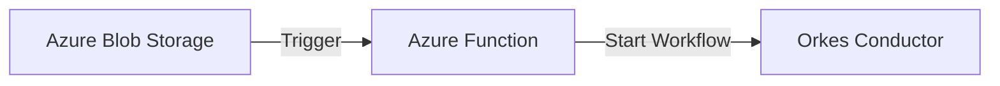

# Blog Topics Configuration

## pdf-extractor
**title:** Building a PDF Table Extractor
**subtitle:** Using Azure Document Intelligence for Automated Table Extraction
**badges:** Python,Azure,Document Intelligence

### Introduction
The PDF Table Extractor is a sophisticated Python application that leverages Azure Document Intelligence (formerly Form Recognizer) to automatically extract and process tabular data from PDF files. This tool streamlines the often complex process of table extraction, making it accessible through a user-friendly Streamlit interface.

### Architecture Overview
```architecture
PDF Upload → Streamlit UI Processing → Azure Document Intelligence Analysis → Table Extraction & Processing → Excel Generation & Download
```

### Implementation
#### Setup Steps
1. Clone the repository
   ```bash
   git clone https://github.com/subashkonar13/PDFTableReader.git
   ```
2. Install dependencies
   ```bash
   pip install -r requirements.txt
   ```
3. Configure Azure credentials

### For More Information
For detailed documentation, source code, and contribution guidelines, visit the project repository:
[View on GitHub](https://github.com/subashkonar13/PDFTableReader)

---

## azure-orkes
**title:** Azure Function & Orkes Integration
**subtitle:** Building Event-Driven Workflows with Azure Functions and Orkes Conductor
**badges:** Azure Functions,Orkes,Workflow,Python

### Introduction
This project demonstrates the integration between Azure Functions and Orkes Conductor (Netflix Conductor), creating an automated workflow that triggers when files are uploaded to Azure Blob Storage. The solution showcases how to build scalable, event-driven architectures using cloud services.

### Architecture Overview


### Key Components
1. **Azure Function (function_app.py)**
   - Implements blob trigger for 'okesblob' container
   - Processes uploaded files
   - Extracts blob metadata
   - Initiates Orkes workflow

2. **Orkes Integration (orkes_call.py)**
   - Handles workflow execution
   - Manages authentication
   - Processes workflow responses

### For More Information
[View on GitHub](https://github.com/subashkonar13/Orkes-AzureConnector)

---

## jupyter-git-branch
**title:** Git Branch Management in Jupyter
**subtitle:** Dynamic Branch Switching and Code Execution in Notebook Environments
**badges:** Git,Jupyter,Python,Databricks

### Introduction
Managing different Git branches within Jupyter notebooks and Databricks environments is crucial for collaborative development and testing. This guide demonstrates how to dynamically switch between branches and execute code from specific branches within notebook environments.

### Implementation Methods
#### Method 1: Direct Package Installation from Branch
Install package directly from specific branch:
```python
%pip install --force-reinstall --no-deps git+https://<token>@github.com/<organisation>/<repo name>.git@<branch-name>
```

#### Method 2: Dynamic Installation with Environment Variables
```python
import os
token = os.getenv('GITHUB_TOKEN')
org = "myorganisation"
repo = "mypackage"
branch = "feature-branch"
%pip install --force-reinstall --no-deps git+https://{token}@github.com/{org}/{repo}.git@{branch}
```

### Best Practices
- Store tokens as environment variables, never hardcode them
- Use minimal required permissions for tokens
- Regularly rotate access tokens
- Clean up cloned repositories after use
- Use virtual environments for dependency isolation

### For More Information
[View on GitHub](https://github.com/subashkonar13/jupyter-git-branch-demo)
